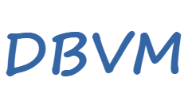

  

> ⭐ Stars = motivation to do more and better. Thank you!

Other languages: [English](README.md) | [Russian](README.ru.md)

DBVM is a general-purpose relational DBMS built on the foundation of Altibase Community Edition. The project combines a reliable architecture with modern improvements.

Key features of DBVM (Altibase CE):
- disk tablespaces: System, Temporary, Undo, Users,
- memory tablespaces (IN-MEMORY feature),
- buffer cache,
- query cache,
- MVCC (Multi-Version Concurrency Control),
- ACID,
- SQL-92 support,
- architecturally, functionally and syntactically (commands) similar to the Oracle Database:
[Altibase/Oracle Comparison](https://docs.altibase.com/pages/viewpage.action?pageId=16875638),
[ORACLE to ALTIBASE Conversion Guide](https://docs.altibase.com/display/arch/ORACLE+to+ALTIBASE+Conversion+Guide).

> Donations are welcome to ETH `0x176080a4074AAf0792d32cA8eE94777070668C7E`, BTC `bc1qlk93dac9q23uk09vzmfa5204a5jc3wdcy6cf3k`, SOL `8dXF6kNCWf4KPSP3J49i4KNz4SgypPJ4Zbmd1xrxq3xN`.

Install from Sources
====================
* **Fedora**: Detailed build instructions are available in [INSTALL.Fedora.md](INSTALL.Fedora.md).

Lisence
=======

This project is licensed under the terms specified in the [COPYING.readme](COPYING.readme) file.

---
*Note: Historical README from the original project can be found in [README-orig.md](doc/legacy/README-orig.md) for reference only.*
